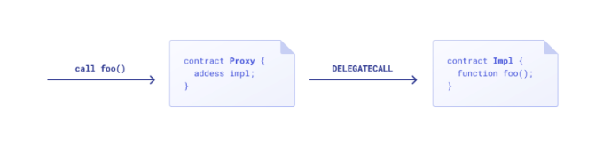
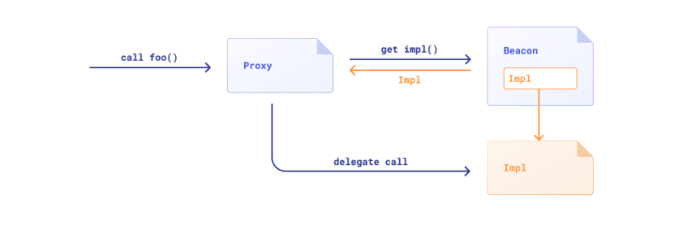

# upgrade

## link

- [learn upgrade](https://docs.openzeppelin.com/learn/upgrading-smart-contracts)
- [upgrade plugin](https://docs.openzeppelin.com/upgrades)
- [proxies contracts](https://docs.openzeppelin.com/contracts/4.x/api/proxy)
- [openZeppelin blog](https://blog.openzeppelin.com/the-state-of-smart-contract-upgrades/#transparent-proxies)

## proxy

- 
- Box can upgrade to BoxV2
- Box can not upgrade to BoxV3, because BoxV3 has not implemented the same interface as Box
- Box can upgrade to BoxV4
- Box can not upgrade to BoxV5, because BoxV5 changed the order of variables definition

## beacon

- 
- Box can upgrade to BoxV2
- Box can not upgrade to BoxV3, because BoxV3 has not implemented the same interface as Box
- Box can upgrade to BoxV4
- Box can not upgrade to BoxV5, because BoxV5 changed the order of variables definition
