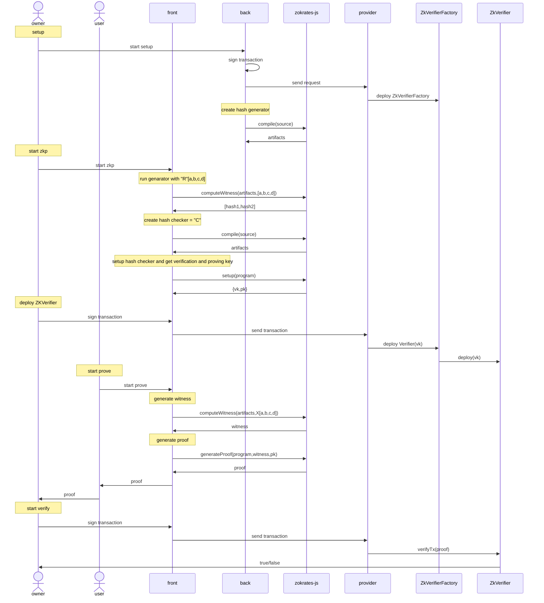

# zkp

## link

- [about za-snark](https://zoom-blc.com/what-is-ethereum-zk-snark)
- [zk-snark ethereum library](https://zokrates.github.io/)
- [qiita](https://qiita.com/qope/items/47c910c1be7e4eb12851)

## algorism of zkp

### variable and method

- R: random number
- C: program
- VK: verification key
- PK: proving key
- PRF: proof
- Generate: method of generating proving key and verification key
- Prove: method of generating proof
- Verify: method of verifying proof

### x \* x = y

- X: private value
- Y: public value
- Generate(R,C) -> (VK, PK)
- Prove(X,Y,PK) -> PRF
- Verify(Y,PRF,VK) -> true

### password

- X: password
- Generate(X,C) -> (VK, PK)
- Prove(X,PK) -> PRF
- Verify(PRF,VK) -> true

## setup

- install

```
# command
curl -LSfs get.zokrat.es | sh

# log
ZoKrates: Tag: latest (0.8.3)
ZoKrates: Detected architecture: aarch64-apple-darwin
ZoKrates: Installing to: /Users/osaguild/.zokrates
ZoKrates: Fetching: https://github.com/ZoKrates/ZoKrates/releases/download/0.8.3/zokrates-0.8.3-aarch64-apple-darwin.tar.gz
ZoKrates was installed successfully!
If this is the first time you're installing ZoKrates run the following:
export PATH=$PATH:/Users/osaguild/.zokrates/bin

# path
export PATH=$PATH:/Users/osaguild/.zokrates/bin
touch ~/.zprofile
```

## example.1: x \* x = y

x is private and y is public. you can prove it hiding x.

### dir

`./zkp/x*x=y`

### root.zok

```
def main(private field x, field y) {
assert(x \* x == y);
return;
}
```

### run

```
# compile
zokrates compile -i root.zok

# generate pk and vk
zokrates setup

# generate proof
zokrates compute-witness -a 4 16
zokrates generate-proof

# verify proof
zokrates verify

# generate verifier.sol
zokrates export-verifier
```

## example.2: password

a,b,c,d are password. you can prove it hiding a,b,c,d.

### dir

`./zkp/password`

### hash.zok

this is program to generate hash from password.

```
import "hashes/sha256/512bitPacked" as sha256packed

def main(private field a, private field b, private field c, private field d) -> field[2]:
field[2] h = sha256packed([a, b, c, d])
return h
```

### generate hash

```
# compile
zokrates compile -i hash.zok

# generate witness
zokrates compute-witness -a '1' '2' '3' '4'

# please check witness file under the directory
# ~out_0 is hash1, ~out_1 is hash2
# use it for next step
```

### hashcheck.zok

copy hash1 and hash2 from previous step, and set hashckeck.zok like below. this is the verification program. above program is just a generator of hash.

```
import "hashes/sha256/512bitPacked" as sha256packed;

def main(private field a, private field b, private field c, private field d) {
field[2] h = sha256packed([a, b, c, d]);
assert(h[0] == 6441948221896607572742608488120559578);
assert(h[1] == 146139290966201238425928859098213699460);
return;
}
```

### run

```
# compile
zokrates compile -i hashcheck.zok

# generate pk and vk
zokrates setup

# generate proof
zokrates compute-witness -a '1' '2' '3' '4'
zokrates generate-proof

# verify proof
zokrates verify

# generate verifier.sol
zokrates export-verifier
```

## sequence diagram


